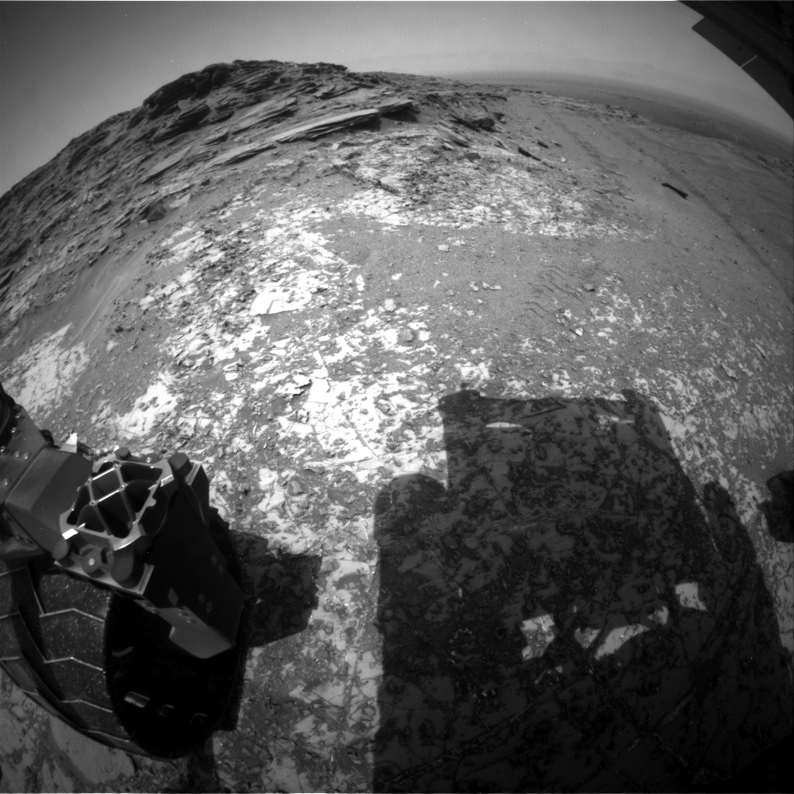

# About
This is a simple program written in python that allows you to download mars rover images via the NASA API. To use the program, you need an API key, I will not provide my own key, however, I will tell you how to get one.

## Example images downloaded from the NASA API

